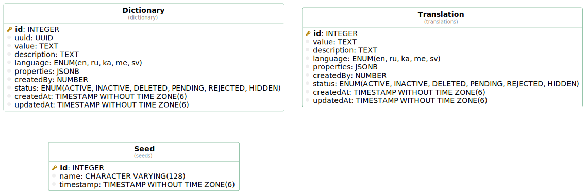

<p align="center">
  <a href='https://github.com/megrulad-ge/backend-service/blob/master/.npmrc#L1'>
    
  </a>
  <a href='https://github.com/megrulad-ge/backend-service/blob/master/.npmrc#L2'>
    
  </a>
  <a href='https://nestjs.com/'>
    
  </a>
  <a href='https://github.com/megrulad-ge/backend-service/blob/master/docs/swagger.yaml'>
    
  </a>
  <a href='megrulad-ge.github.io/backend-service'>
    
  </a>
</p>

## Description

Template repository for backend services. With required boilerplate code.

## Installation

```bash
$ npm install
```

## Running the app

```bash
# development
$ npm run start

# watch mode
$ npm run start:dev

# production mode
$ npm run start:prod
```

## Test

```bash
# unit tests
$ npm run test

# e2e tests
$ npm run test:e2e

# test coverage
$ npm run test:cov
```

## Database

<section>
<details>
<summary>Migrations</summary>
<p>
There are migration scripts located in package.json.

In most common cases you will need to use `npm run migration:generate -- migrations/migration-name` to generate migrations (Which will result creating migrations/migration-name.ts). There are initial database setup and when you add some changes the command mentioned above will generate new migration scripts. It is required to check the generated query since it can cause data lost.

When you need to run `npm run migrations`? Only when you make changes in entities or creating a new one.

If you're actively adding new entities and need to test things faster you can modify `orm.config.ts` with the following

```json
{
  "synchronize": true,
  "synchronizeOptions": {
    "force": true
  }
}
```
With this config there are high change of data loss. Since it always removes tables and creates new ones. Only convenient for development when actively adding new entities.

When this `sync` mode is enabled, and you try to generate migration - it won't be able to detect changes because `sync` mode makes sure that all tables are created/synced.

Recommended: When you alter schema => `npm run migration:generate migrations/some-changes` => `npm run migrations`.

It might require running `npm run build`.

```bash
$ npm run build
$ npm run migration:generate migrations/migration-name
```

P.S.

You can always manually create migrations by running `npm run migration:create migrations/add-users-table` however in such cases you are responsible for the correctness of the script while `npm run migration:generate` will reverse-generate the migration from existing schemas/entities.

`NOTE:` Current migration scripts contains env variable for schema name which is dynamic name. Library does not support such thing. So when generating/creating new migration makes sure it is using proper schema name for different envs. Since, for every deployment env there is the same db but different schema.
More [details](./migrations/README.md)
</p>

More [info](https://typeorm.io/using-cli#create-a-new-migration)
</details>

<details>
<summary>UML diagram</summary>



</details>
</section>

